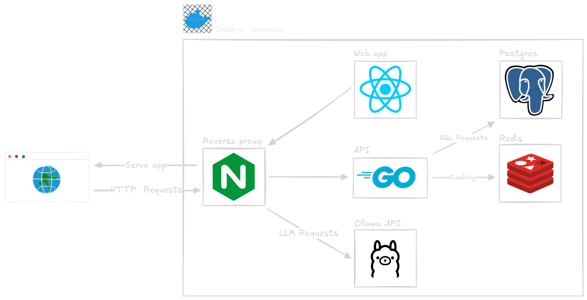

## Ideas
- Hosted Docker images on GitHub with automated build pipelines on pull requests
- Animated wiz when password matches the database list (msn nostalgia)
- Rock music when password matches the database list
- Formatting and linting with Prettier/ESLint
- Unit tests + integration tests using Testcontainers

## Notes
- I chose to make a multi-stage image for the frontend, first layer for building Vite, second for lightweight production-ready
- Over-engineered, but Nginx reverse proxy allows caching, load balancing, static serving, SSL, and many more. This choice is for scalability.
- The password database is pretty big; having an in-memory cache like Redis can speed up frequent password requests.
- For now, passwords will be loaded at API startup, skipped if the database already contains it. Also, I use Postgres because the job is asking for it :)
- Ollama for some AI hype, mainly used for rating passwords on a 5 stars scale.

