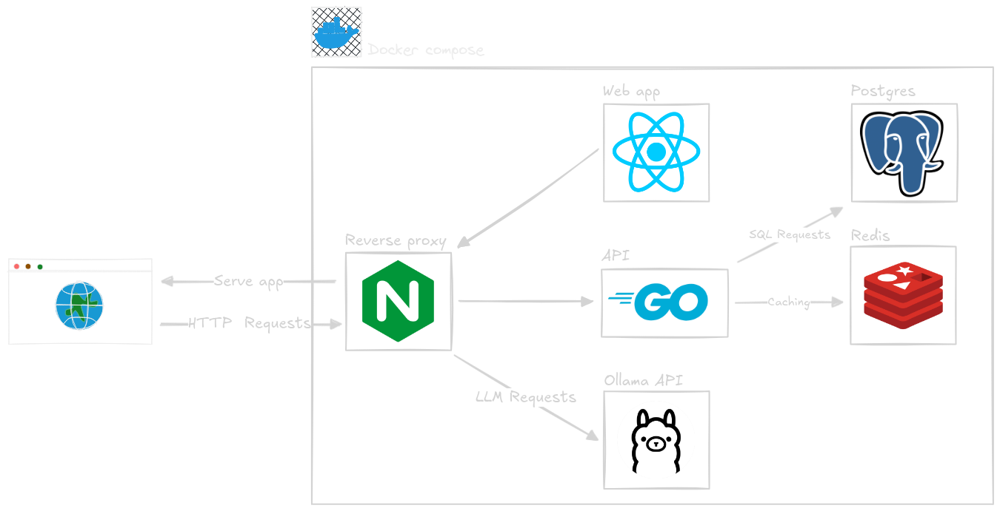

<h1 align="center">HAVE I BEENROCKED</h1>

<p align="center">
  
  
  
  
  
  
  
  
</p>

---

## 📋 Table of Contents

1. [Overview](#-overview)
2. [Stack](#-stack)
3. [Features](#-features)
4. [Setup](#%EF%B8%8F-setup)
   - [Prerequisites](#prerequisites)
   - [How to import rockyou database](#import-the-rockyou-database)
   - [How to run the app](#how-to-run-the-app)
5. [Contributing](#contributing)

---

## 🌟 Overview

**Have I Been Rocked** is a tool designed to check if a password has been compromised using the infamous `RockYou.txt` dataset.

---

## 🚀 Stack



- **Backend**: Golang<br>
Go is used for the backend API, providing a fast and efficient server-side solution. It is my favorite language for building robust and scalable applications.
- **Frontend**: React, Vite, TypeScript.<br>
React is used for the frontend, providing a dynamic and responsive user interface. Vite is used as the build tool for fast development and TypeScript adds type safety to the codebase.
- **Database**: Redis.<br>
Redis is used as a cache for frequently requested passwords, allowing for quick lookups and reducing the load on the database.
- **Reverse Proxy**: Nginx<br>
I used Nginx as a reverse proxy to handle incoming requests and route them to the appropriate service. Allowing to serve the frontend and backend on the same domain.
- **Containers**: Docker / Docker Compose

---

## 🔧 Features

- **K-anonymity**: First of all, the passwords are stored as SHA-1 hash (I wanted to use a more robust one like bcrypt or Argon2 but the salt made the implementation of k-anonymity too complex as I would have to share the salt with the frontend. Also SHA-1 is way faster).<br>
When the client requests a password lookup, the password is hashed and only the first 5 characters of this hash are sent to the server. The server then returns a list of matching hashes. This ensures that the server never sees the full hash, and even if the connection between the client and server is compromised, the attacker will not be able to identify the right hash.
- **Caching**: Utilizes Redis for fast lookups of frequently requested passwords.
To avoid overloading the database with requests, the application caches the most frequently requested passwords in Redis. This allows for quick lookups and reduces the load on the database.
- **Developer-Friendly**: Includes Mage tasks for streamlined development and deployment workflows.
- **AI Integration**: Uses Ollama for local LLM capabilities, providing a rating of password strength.

---

## 🛠️ Setup

## Prerequisites

Before running the application, ensure you have the following installed:

- [Docker](https://www.docker.com/) (v20.10.0 or higher)
- [Docker Compose](https://docs.docker.com/compose/) (v2.0.0 or higher)
- [Golang](https://golang.org/) (v1.20 or higher)
- [Mage](https://magefile.org/) (v1.14.0 or higher, for running project specific scripts)
- [Node.js](https://nodejs.org/) (v18.0.0 or higher, optional, for frontend development)
- [Bun](https://bun.sh/) (v1.0.0 or higher, optional, for frontend development)

### Clone the repository

```bash
git clone https://github.com/mhd-sdk/haveibeenrocked.git
```
### Navigate to the project directory
```bash
cd haveibeenrocked
```

### Import the rockyou database
The following command will download the password database and create a SQL file.
This SQL file will then automatically be loaded in a docker volume for the postgres database, which will execute it on startup.

```bash
mage loadpasswords
```

You can check if the `import.sql` file is present in the `db` folder.
Please don't open it, it's a huge file, your code editor **WILL** crash.

## How to run the app
To run the entire stack, including the backend and frontend, you can use the following command:

```bash
mage DockerProd
```
This command will build and run the Docker containers for both the backend and frontend services. The app will be accessible on `http://localhost`.

## Contributing
To facilitate development, the project includes a second docker-compose file that sets up the necessary services. you can run it using the following command:

```bash
mage DockerDev
```
then you can start the backend server using:

```bash
mage dev
```
For the frontend, first cd into `frontend` folder, then you can use:

```
bun run dev
```
We use gitmoji for commit messages, so please use them when committing your changes. You can find the list of available emojis [here](https://gitmoji.dev/).

